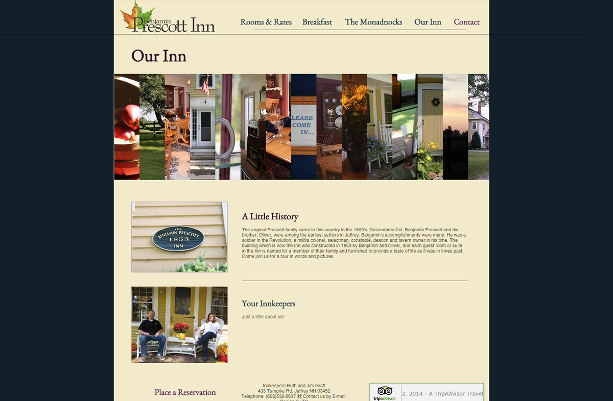

I redesigned the website for a New Hampshire bed and breakfast, the [Benjamin Prescott Inn](https://www.benjaminprescottinn.com), in their existing Wix CMS.

Their delicious breakfasts:

Landing page:

About us page:

