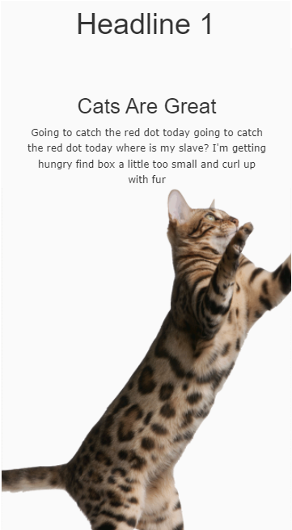
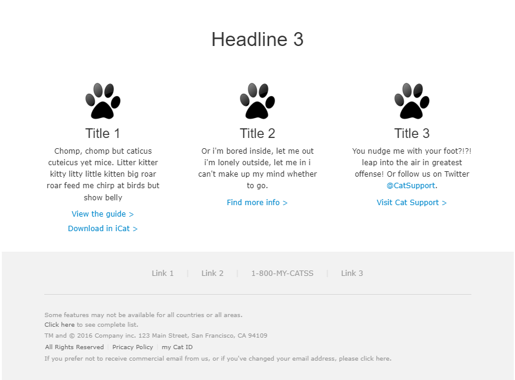
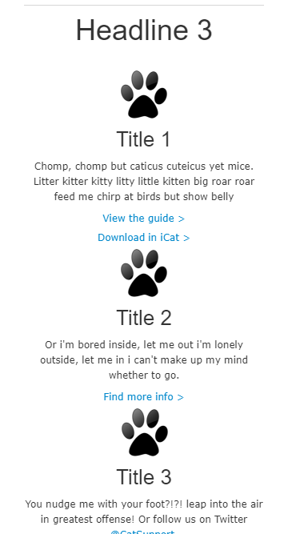

*Personal project!*

An html email template demonstration project using [placekitten](https://placekitten.com) and [Cat Ipsum](https://pages.cs.wisc.edu/~gabrielse/cs400/catIpsum.html), featuring our favorite furry feline  assassins friends.

Here is an iPhone 5e view of the hero image:

I'd also like to compare the desktop and iPhone 3e view of the 3rd heading section:

Contact me if you are interested in seeing my HTML for this project.

I used EmailOnAcid to test this template across 30 different clients.
