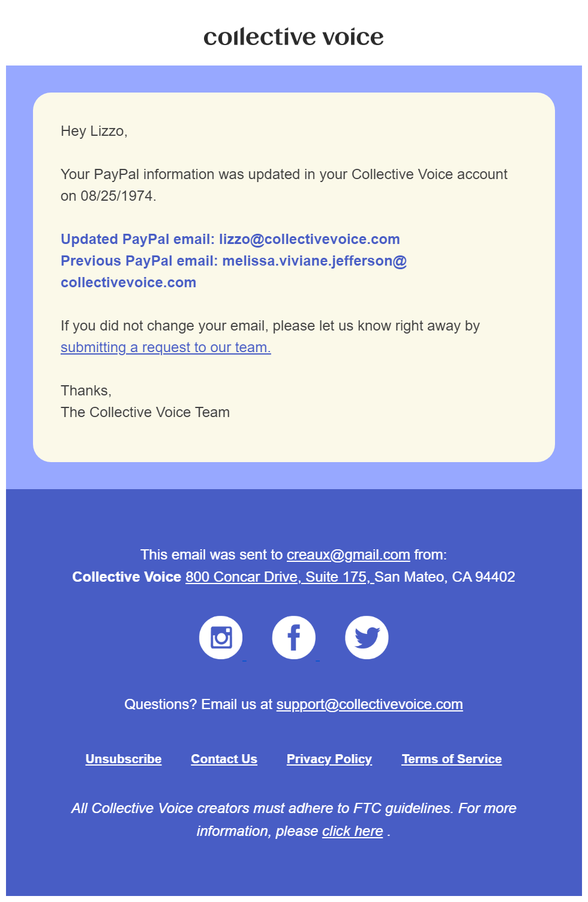

In 2023, [Collective Voice](https://www.collectivevoice.com) rebranded from their previous name, ShopStyle Collective. I spent a quarter rebranding their transactional email campaigns, and I took advantage of this opportunity to rebuilt their emails into an atomized, component-based system.

Here's a further detail from the preview:

Below are two transactional emails showing a basic feature of the new component system, where template variables set the color of their own background.

The code for these emails is property of Rakuten via Collective Voice, so I am not at liberty to share.