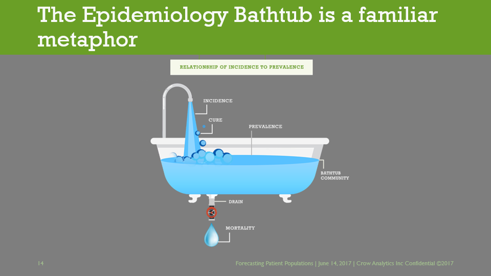
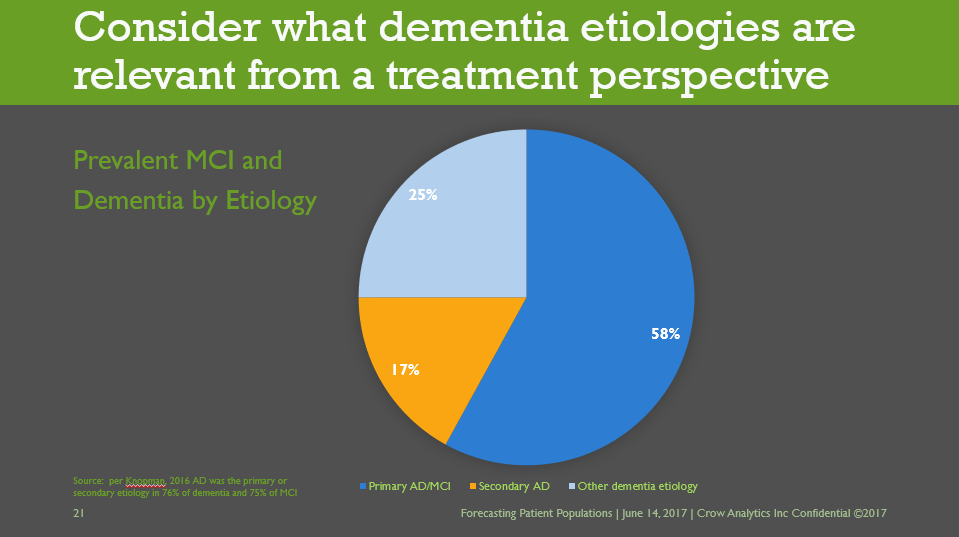

I was contracted to do complete branding for Crow Analytics, from logo and look-and-feel to website development.

The project also involved styling a highly technical and dense slide deck, and styling the client's proprietary excel workbook.

I used posterizing filters on photographs of my client's chosen parks as a theme for the website.

I also styled a slide show, working to help my client present the required super-dense data:

