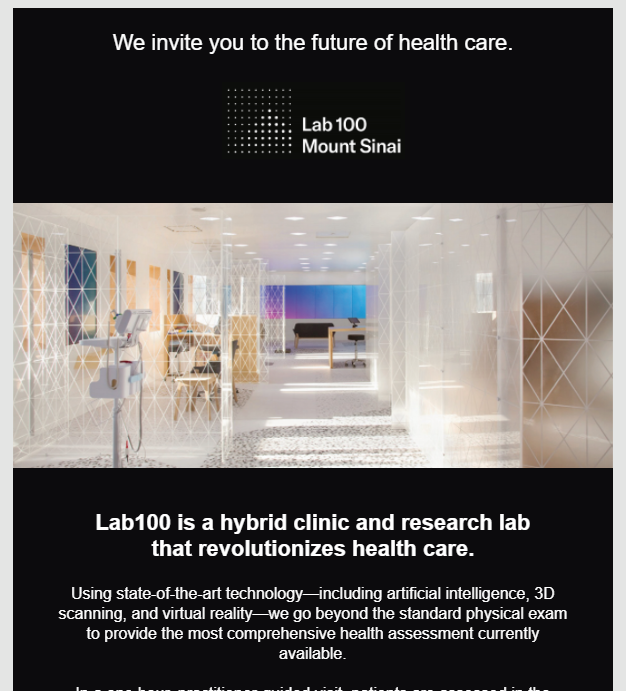
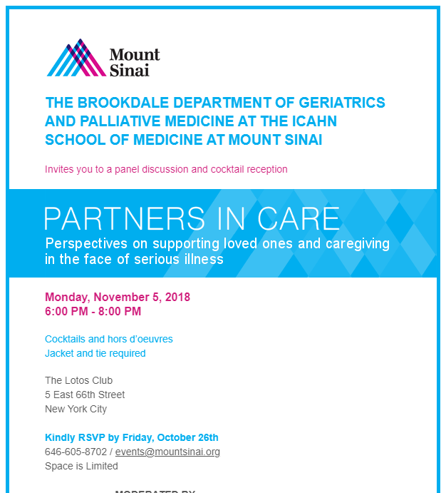

From 2015 to 2019, I supported the fundraising team at [Icahn School of Medicine at Mount Sinai](https://giving.mountsinai.org/site/SPageServer) by building and testing HTML email templates. I worked from PDF mockups. After the email was coded, I would verify functionality with EmailOnAcid. Then, I would upload the templates into their BlackBaud Luminate CMS, attach mailing lists, submit the prepared campaign for verification, and then send the email blasts.

Here are screenshots of several email templates I worked on:

Contact me if you would like to see any of the HTML for the above emails.

In addition, I also updated their website through their CMS.
