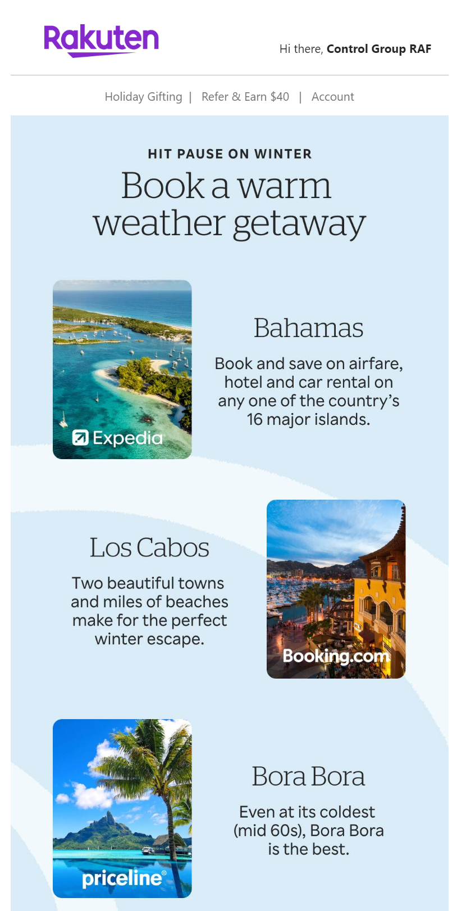

In 2024, I switched teams from ShopStyle to <a href="https://www.rakuten.com" target ="blank">Rakuten</a>'s marketing squad.

Here's a further detail from the preview:

In 2023, I joined members of Rakuten's marketing team for a hackathon, and the product we created there was built into Rakuten's marketing email system going forward. Joining the team, I had the opportunity to use this system to produce, QA, and configure marketing campaigns.

I was the primary producer on an experimental single daily email project, which would draw together a custom daily email for each recipient featuring all triggered transactional content as well as either evergreen or campaign marketing content. Here is an example of one such email:

The code for these emails is property of Rakuten, so I am not at liberty to share.
