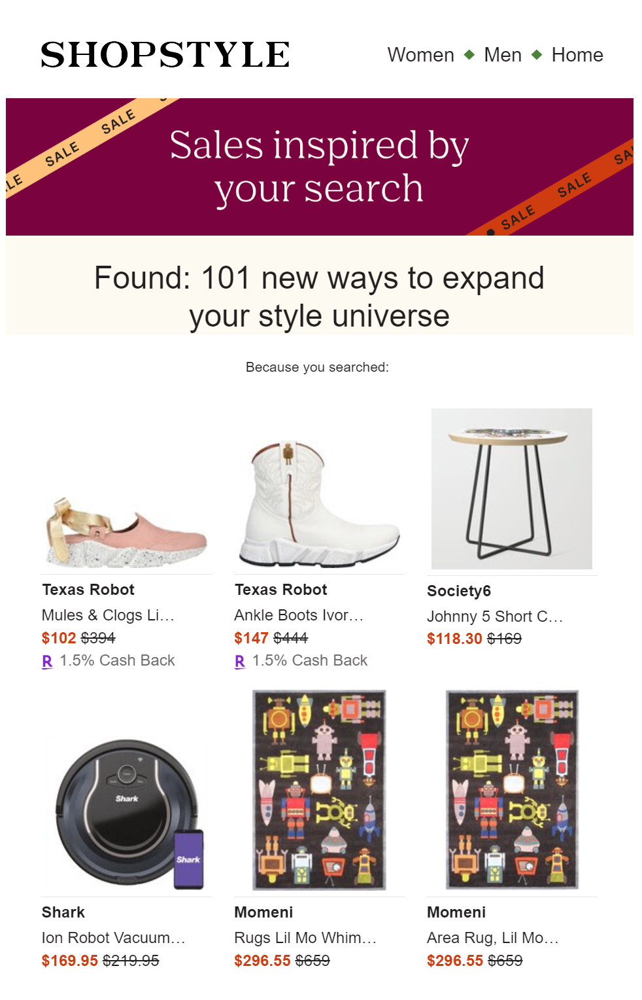
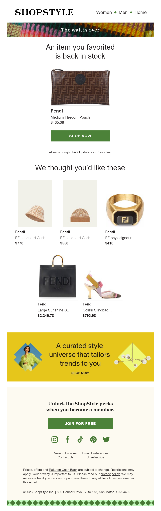

I was brought on at ShopStyle, a Rakuten subsidiary, in 2022 to lead a reskin and rebuilt of their 17 template transactional email portfolio.

In addition, I was able to add components such as an advanced specific click tracking system and a <a href="https://www.shopstyle.com" target="blank">shopstyle.com</a> site search from an email's footer. I was provide thorough analytics on the relative performance of our messages. I was able to offer valuable insight into segmentation (such as the proportion of our userbase viewing emails in dark mode or on mobile). I delivered presentations to the design and marketing team on topics such as email accessibility and email design considerations. I also assisted the marketing team by creating and supporting drag-and-drop templates. 

Here's a further detail from the preview:

This email returns results from the ShopStyle.com user's saved searches when various online retailers' products on ShopStyle go on sale. There were three specific challenges for this templates. First, I needed to figure out how to reflect the user's search intention without using their actual text to avoid inappropriate copy in our messaging. Second, the email needed to be able to display a thorough number of the user's saved search results, whether the user has results for only one search or if they approach our cap. Third, the product images are provided by the retailer, so the aspect ratio of images could not be predicted, and the email had to look professional and ordered whether the product images were tall and narrow or short and flat.

Here's another transactional template I built, this time for a back in stock notification. Note the variety of data displayed in the product cells:

Another feature here is the yellow banner; this was connected to ShopStyle's proprietary CMS system, Boutique, to allow marketers to schedule specific banners and links for automatic display.

The code for these emails is property of Rakuten via ShopStyle, so I am not at liberty to share.
