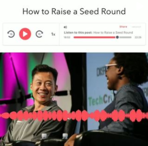
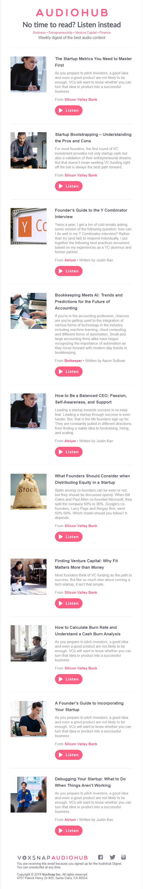

As a contract marketer for [VoxSnap](https://voxsnap.com), I built a template for a monthly newsletter showcasing new podcasts on VoxSnap's AudioHub library.

Another core task was creating daily social media posts, including composing copy, creating audiovisual assets, and scheduling across all VoxSnap's social media accounts.

I also wrote manuals for marketing interns; [download an example pdf on how to prepare social posts here.](https://drive.google.com/file/d/1eh8CO4OpP_HCNa6jNNGQgTXM5DQmq8W9/view?usp=sharing).

In addition, I performed market research, built both social media and SEO strategy, and established/monitored KPIs.

## The full newsletter:

Hero Image from [VoxSnap audioblog article](https://article.voxsnap.com/svb/the-startup-metrics-you-need-to-master-first)
by [Silicon Valley Bank](https://www.svb.com)
